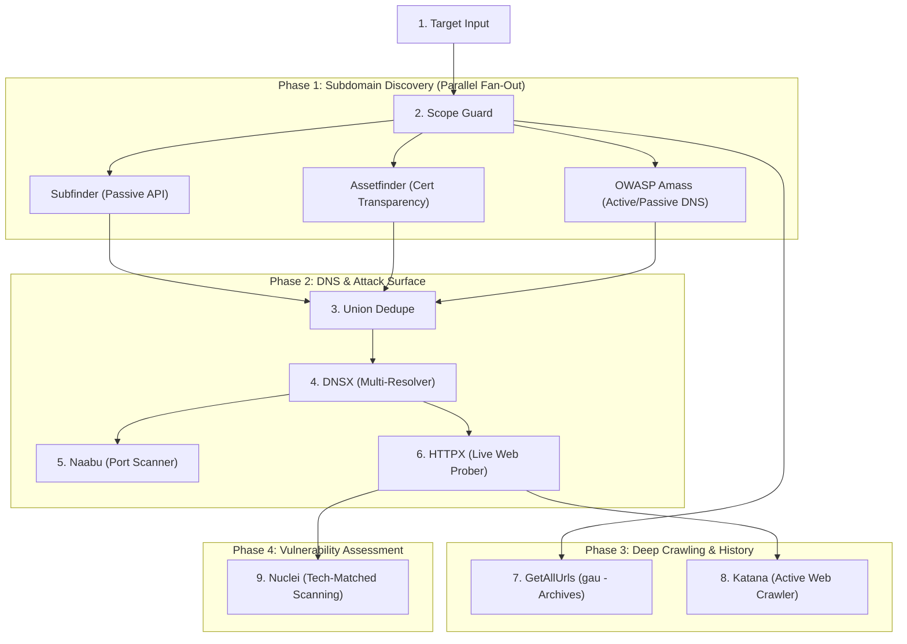

<p align="center">
  
</p>

<h1 align="center">AstraRecon</h1>

<p align="center">
  <strong>Visual Recon Workflow Engine</strong><br>
  <em>Linux-first, DAG-orchestrated reconnaissance with persistent sessions, CAS caching, multi-tool fan-out, and AI-ready exports.</em>
</p>

<p align="center">
  <a href="https://pypi.org/project/astrarecon/"></a>
  
  
  
  
  <a href="LICENSE"></a>
</p>

---

## What is AstraRecon?

**AstraRecon** is not another wrapper around security binaries. It is an autonomous, graph-based **recon workflow engine** built for modern security engineers, red teams, and bug bounty hunters.

It executes complex fan-in and fan-out reconnaissance pipelines using a directed acyclic graph (DAG) scheduler — zero terminal spam, zero lost state, and zero redundant re-execution.

---

## Highlights

| Feature | Description |
| :--- | :--- |
| **Full 12-Stage Pipeline** | End-to-end autonomous recon by default: subdomain fan-out, deduplication, DNS probing, port scanning, web probing, deep crawling, archive retrieval, and automated vulnerability scanning. |
| **Workflow Presets** | Instant flexibility via `--workflow` presets: `default` (full 12 stages), `fast` (quick triage), `passive` (non-intrusive), and `vuln` (targeted vulnerability checks). |
| **Fault-Tolerant DAG** | Dynamic ready-frontier scheduling via Kahn's topological sort. If an optional passive tool encounters a timeout, downstream aggregators proceed gracefully. |
| **Persistent Sessions & Resumption** | Atomic node checkpoints allow interrupted or aborted scans to resume instantly with zero duplicate API or network work. |
| **Complete Session Lifecycle** | Full session management: list, inspect, prune old runs, or clear historical sessions with `astrarecon sessions clear` or `--clear`. |
| **Content-Addressed Cache (CAS)** | SHA-256 blob store keyed on tool version + configuration + input hash completely bypasses re-running identical steps. |
| **Rich Live UI** | In-place terminal viewport with real-time spinners, execution timers, and live item counters — zero scroll buffer spam. |
| **AI Distillation Bundles** | Compresses raw scan outputs into token-budgeted prompt bundles ready for GPT-4o, Claude 3.5 Sonnet, and Gemini 1.5 Pro. |

---

## Default Multi-Tool Pipeline Architecture

When you run `astrarecon scan <target>`, AstraRecon automatically constructs and dispatches the full 12-node reconnaissance pipeline:



---

## Interface Tour

### 1. Live Scan Dashboard — `astrarecon scan example.com`

```text
╭─ ASTRARECON ─ example.com [00:42] ──────────────────────────╮
│                                                             │
│  ✔  Target Input       Success         0.0s        1 items  │
│  ✔  Scope Guard        Success         0.0s        1 items  │
│  ✔  Subfinder          Success         4.2s      142 items  │
│  ✔  Assetfinder        Success         2.8s       88 items  │
│  ✔  OWASP Amass        Success        32.1s      194 items  │
│  ✔  Union Dedupe       Success         0.1s      216 items  │
│  ✔  DNSX               Success         3.4s       48 items  │
│  ✔  Naabu              Success        12.8s       72 items  │
│  ✔  HTTPX              Success         4.1s       48 items  │
│  ✔  GetAllUrls (gau)   Success         8.6s      512 items  │
│  ✔  Katana             Success        15.3s      340 items  │
│  ✔  Nuclei             Success        18.7s        3 items  │
│   ────────────────────────────────────────────────────────  │
│   ✔ All 12 pipeline stages completed successfully.          │
│                                                             │
╰─────────────────────────────────────────────────────────────╯
```

### 2. Existing Session Detection & Quick Actions

When previous recon runs exist for the target, AstraRecon presents an interactive menu with instant resumption, viewing, and clearing options:

```text
╭─ ASTRARECON ─ Existing Sessions Detected ───────────────────────────────────╮
│                                                                             │
│  Found 2 existing recon session(s) for target 'example.com':                │
│                                                                             │
│  [1] 2026-09-26-002-example-com   5m ago   ● Completed     12/12 stages done│
│  [2] 2026-09-26-001-example-com   2h ago   ● Interrupted    7/12 stages done│
│                                                                             │
│  Actions:                                                                   │
│  [v] View results for latest session                                        │
│  [r] Resume / re-run latest session                                         │
│  [f] Start a fresh scan (create new session)                                │
│  [c] Clear all existing sessions for 'example.com' and start fresh          │
│  [q] Cancel and exit                                                        │
│                                                                             │
╰─────────────────────────────────────────────────────────────────────────────╯
```

### 3. Post-Scan Summary & Results Table

```text
╭──────────────────────────────────────────────────────────────╮
│                                                              │
│   ✔ Scan Completed for example.com in 00m 42s                │
│   ──────────────────────────────────────────────────         │
│   Session ID          2026-09-26-002-example-com             │
│   Subdomains          216                                    │
│   Live HTTP Hosts     48                                     │
│   Vulnerabilities     3                                      │
│   AI Export Bundle    ~/.astrarecon/sessions/.../exports     │
│                                                              │
│   Run 'astrarecon export ai 2026-09-26-002-example-com'      │
│   to inspect the prompt bundle.                              │
│                                                              │
╰──────────────────────────────────────────────────────────────╯
```

---

## Workflow Presets

Choose the ideal balance of speed and depth using `--workflow` (`-w`):

| Preset | Command | Included Stages | Best For |
| :--- | :--- | :--- | :--- |
| **Default / Full** | `astrarecon scan target.com` | Target Input, Scope Guard, Subfinder, Assetfinder, Amass, Union Dedupe, DNSX, Naabu, HTTPX, GAU, Katana, Nuclei | Complete surface mapping and vulnerability discovery |
| **Fast** | `astrarecon scan target.com -w fast` | Target Input, Scope Guard, Subfinder, DNSX, HTTPX | Rapid asset triage in under 30 seconds |
| **Passive** | `astrarecon scan target.com -w passive` | Target Input, Scope Guard, Subfinder, Assetfinder, Amass, Union Dedupe, GAU | Stealthy, non-intrusive OSINT and archive discovery |
| **Vulnerability** | `astrarecon scan target.com -w vuln` | Target Input, Scope Guard, Subfinder, DNSX, HTTPX, Nuclei | Direct security audits on resolving live endpoints |

---

## Integrated Arsenal (13 Tools)

AstraRecon orchestrates 13 industry-standard reconnaissance tools via declarative YAML manifests:

| Category | Tool | Description |
| :--- | :--- | :--- |
| **Subdomain Enumeration** | `subfinder` | High-speed passive subdomain enumeration via passive APIs |
| | `assetfinder` | Finds domains and subdomains from Certificate Transparency logs |
| | `amass` | In-depth network mapping and recursive DNS enumeration |
| | `subenum` | Automated subdomain harvesting shell script |
| **DNS Resolution** | `dnsx` | Multi-resolver DNS probing & wildcard filtering |
| **Port Scanning** | `naabu` | Fast TCP port scanner for network service discovery |
| **Live Probing** | `httpx` | Live web server probing, title extraction, and tech profiling |
| **Deep Crawling & Archive**| `gau` | Fetches historical URLs from Wayback, AlienVault & Common Crawl |
| | `katana` | Active JavaScript crawling and dynamic endpoint discovery |
| | `waybackurls` | Historical URL harvesting from the Wayback Machine |
| **Endpoint Extraction** | `linkfinder` | Python AST endpoint extraction from `.js` files |
| **Vulnerability Scanning** | `nuclei` | Fast, template-based vulnerability assessment with auto tech-detection |
| **XSS Testing** | `dalfox` | Parameter analysis and Cross-Site Scripting (XSS) scanner |

---

## Installation

### Requirements

- Python **3.11+**
- Linux (Ubuntu, Debian, Kali, Arch) or **WSL2** (Windows Subsystem for Linux)
- Go **1.21+** (for building third-party Go binaries)

### Recommended Install (`uv tool`)

```bash
uv tool install astrarecon
```

### Alternative Methods

```bash
# Using pipx
pipx install astrarecon

# Using pip
python3.11 -m pip install astrarecon
```

### From Source

```bash
git clone https://github.com/LavSarkari/AstraRecon.git
cd AstraRecon

python3.11 -m venv .venv
source .venv/bin/activate

pip install -e ".[dev]"
```

### Tool Bootstrap & Doctor

After installation, run the diagnostic doctor to inspect or automatically install all missing binaries:

```bash
# Inspect environment and installed tool status
astrarecon doctor

# Automatically install and compile missing tools into ~/.astrarecon/bin/
astrarecon doctor --install-missing
```

---

## Usage Guide

### Basic Scanning

```bash
# Full 12-stage automated reconnaissance
astrarecon scan example.com

# Start fresh, bypassing any existing session prompts
astrarecon scan example.com --fresh

# Clear previous sessions for this target before scanning
astrarecon scan example.com --clear

# Run a lightweight quick scan
astrarecon scan example.com --workflow fast

# Run passive reconnaissance only
astrarecon scan example.com --workflow passive
```

### Resume & Continuous Recon

```bash
# Resume an interrupted or failed session
astrarecon scan example.com --resume 2026-09-26-001-example-com

# Continuous recon: scan only newly discovered assets since last baseline
astrarecon scan example.com --diff-only
```

### Proxying & Scope Control

```bash
# Route all scanner network traffic through upstream HTTP or SOCKS5 proxy
astrarecon scan example.com --proxy http://127.0.0.1:8080

# Inject custom headers (e.g. authorization or bug bounty verification headers)
astrarecon scan example.com -H "X-Bug-Bounty: hackerone-handle"

# Strict scope enforcement
astrarecon scan example.com --scope-include ".*\.example\.com$" --scope-exclude ".*\.internal\.example\.com$"
```

### Output & File Export

```bash
# Save output to file (format auto-detected by extension: .json, .md, .csv)
astrarecon scan example.com --output results.json
astrarecon scan example.com --output report.md
astrarecon scan example.com --output data.csv

# View summary card only, omitting terminal result tables
astrarecon scan example.com --no-results
```

---

## Session Management

AstraRecon stores all session metadata, node checkpoints, logs, and artifacts in `~/.astrarecon/sessions/`.

```bash
# List all recorded sessions with age, status, and progress
astrarecon sessions list

# Inspect detailed checkpoint breakdown and failure logs for a session
astrarecon sessions inspect <session-id>

# Clear all recorded scan sessions and reclaim disk space
astrarecon sessions clear

# Clear sessions for a specific target only
astrarecon sessions clear --target example.com

# Force clear without confirmation prompt
astrarecon sessions clear --force

# Delete a single specific session
astrarecon sessions delete <session-id>

# Prune sessions older than N days or delete failed/interrupted runs
astrarecon sessions prune --days 7
astrarecon sessions prune --failed-only
```

---

## AI Distillation Bundle

Every completed scan automatically distills raw security artifacts into an LLM-optimized prompt bundle located at `~/.astrarecon/sessions/<session-id>/exports/ai/`:

| Artifact | Purpose |
| :--- | :--- |
| `context.json` | Target scope, CIDR ranges, root domains, and environment fingerprint |
| `findings.json` | Triaged vulnerabilities by severity with reproducible `curl` validation commands |
| `js_manifest.json` | Extracted API endpoints, hardcoded tokens, and routes from JavaScript files |
| `prompt.md` | Pre-populated system prompt designed for **GPT-4o**, **Claude 3.5 Sonnet**, and **Gemini 1.5 Pro** without exceeding token budgets |

To re-export or inspect an AI bundle for a past session:

```bash
astrarecon export ai <session-id>
```

---

## Updating AstraRecon

AstraRecon includes a built-in smart updater that detects whether your environment is managed by `uv tool`, `pipx`, or standard `pip`:

```bash
# Update to latest stable release from PyPI
astrarecon update

# Check for updates without installing
astrarecon update --check

# Install latest bleeding-edge commit directly from GitHub main
astrarecon update --source github
```

---

## Contributing & Testing

```bash
# Run the complete test suite (35 unit and integration tests)
uv run --with pytest --with pytest-asyncio pytest tests/

# Build distribution bundle
python -m build

# Validate package distribution
python -m twine check dist/*
```

Pull requests and issues are welcome! For major pipeline changes or new plugins, please open an issue first to discuss the design.

---

## License

Distributed under the **MIT License**. See [`LICENSE`](LICENSE) for more information.

<p align="center">
  <sub>Built with ❤️ by <a href="https://github.com/LavSarkari">LavSarkari</a> for security engineers who want reconnaissance to behave like a resilient workflow.</sub>
</p>
