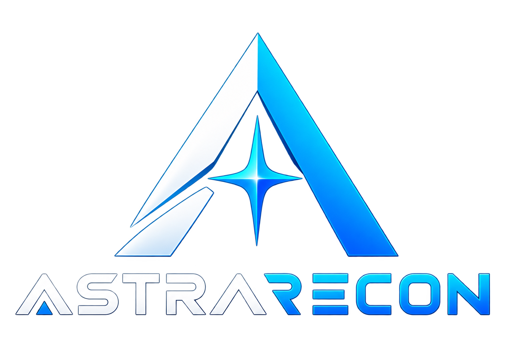

# AstraRecon

<p align="center">
  
</p>

<h1 align="center">ASTRARECON</h1>

<p align="center">
  <strong>Visual Recon Workflow Engine</strong><br>
  <em>Linux-first, plugin-based reconnaissance orchestration with DAG execution, persistent sessions, content-addressed caching, and AI-ready exports.</em>
</p>

<p align="center">
  <a href="https://pypi.org/project/astrarecon/"></a>
  <a href="https://github.com/LavSarkari/AstraRecon/actions/workflows/ci.yml"></a>
  
  
  
  
</p>

> AstraRecon is a headless recon workflow engine designed to orchestrate existing security tools through a persistent, recoverable DAG rather than a fragile chain of shell commands.

## Why AstraRecon?

AstraRecon is built around the idea that reconnaissance should behave like a workflow system.

- **DAG execution** — independent stages can run concurrently while dependency order is preserved.
- **Persistent sessions** — interrupted scans can resume from valid checkpoints instead of restarting from zero.
- **Plugin architecture** — tools are integrations, not hardcoded logic; custom plugins can be added without changing the core engine.
- **Content-addressed caching** — reusable artifacts are keyed by plugin, tool version, configuration, and input data.
- **AI-ready exports** — scan data is normalized and distilled into structured bundles for downstream LLM analysis.
- **Rich CLI** — live status updates replace noisy terminal output.

## Architecture

```text
Target
  │
  ▼
┌───────────────────────────────┐
│       Workflow / DAG          │
└───────────────┬───────────────┘
                │
        ┌───────┴────────┐
        ▼                ▼
   Plugin Nodes      Built-in Nodes
        │                │
        └───────┬────────┘
                ▼
      Execution + Checkpoints
                │
        ┌───────┼────────┐
        ▼       ▼        ▼
     SQLite     CAS    Raw Artifacts
        │
        ▼
 Reports + AI Export
```

The engine is intentionally headless. A future visual workflow editor can sit on top of the same execution engine without duplicating orchestration logic.

## Core Recon Pipeline

The initial plugin ecosystem covers the requested end-to-end workflow:

```text
                    ┌─ subfinder ─┐
                    ├─ assetfinder ┤
Target ─────────────┼─ amass ──────┼──► Union / Dedupe ──► dnsx
                    └─ subenum ────┘
                                              │
                                              ▼
                                            httpx
                                          ┌───┴────┐
                                          ▼        ▼
                                        naabu   URL Collection
                                                  │
                                      ┌───────────┼───────────┐
                                      ▼           ▼           ▼
                                     gau    waybackurls     katana
                                      └───────────┬───────────┘
                                                  ▼
                                             LinkFinder
                                                  │
                                                  ▼
                                               nuclei
                                                  │
                                                  ▼
                                               dalfox
                                                  │
                                                  ▼
                                            HTML / JSON
```

### Included tools

| Stage | Tool |
|---|---|
| Subdomain enumeration | `subfinder`, `assetfinder`, `amass`, `subenum.sh` |
| DNS validation | `dnsx` |
| Live hosts + tech detection | `httpx` |
| Port discovery | `naabu` |
| URL discovery | `gau`, `waybackurls`, `katana` |
| JavaScript endpoint discovery | `LinkFinder` |
| Vulnerability scanning | `nuclei` |
| XSS parameter testing | `Dalfox` |
| Reporting | HTML + JSON |

## Persistent Sessions

Every scan is stored as a recoverable session.

```text
Interrupted session detected

Target: example.com
Last completed node: HTTPX

[R] Resume
[N] Start new session
[V] Inspect session
```

Resume explicitly with:

```bash
astrarecon scan example.com --resume <session-id>
```

Session state includes checkpoints, workflow snapshot, environment fingerprint, logs, and artifacts.

## Content-Addressed Cache

AstraRecon uses a content-addressed artifact store to avoid unnecessary re-execution.

```text
CacheKey =
SHA256(
  PluginID +
  PluginVersion +
  ToolVersion +
  ConfigHash +
  InputArtifactHash
)
```

Cache policies can distinguish fresh, stale, and non-cacheable stages. Active vulnerability testing is intentionally treated differently from passive discovery.

## Plugin System

A plugin is a declarative integration around an external tool.

```text
~/.astrarecon/plugins/<plugin>/
├── plugin.yaml
├── runner.py     # optional
└── parser.py     # optional
```

Each manifest can declare:

- plugin version
- binary name and version detection
- installation recipe
- typed inputs and outputs
- command arguments
- timeout / retry policy
- cache policy

Useful commands:

```bash
astrarecon plugins list
astrarecon plugins enable <plugin>
astrarecon plugins disable <plugin>
astrarecon plugins test <plugin>
```

Custom scripts and binaries can be integrated without changing the scheduler.

## Environment Doctor

Before a scan, AstraRecon can inspect the Linux / WSL environment:

```bash
astrarecon doctor
```

It reports:

- Linux distribution / WSL
- Python and Go
- PATH
- installed tool versions
- missing dependencies

Optional bootstrap:

```bash
astrarecon doctor --install-missing
```

## CLI UX

AstraRecon uses a minimal Rich-based interface with live in-place updates.

```text
╭─ ASTRARECON ─────────────────────────────╮
│ ✔ Subfinder              Success         │
│ ✔ Assetfinder            Success         │
│ ▶ DNSX                   Running         │
│ ● HTTPX                  Waiting         │
╰──────────────────────────────────────────╯
```

The interface is designed to avoid terminal spam while still exposing execution state.

## Reports and AI Export

A completed session can produce:

```text
exports/
├── ai/
│   ├── context.json
│   ├── findings.json
│   ├── js_manifest.json
│   └── prompt.md
├── summary.md
└── report.json
```

The AI bundle is intended to provide compact, structured context for GPT, Claude, Gemini, and other downstream analysis tools rather than dumping raw scan output into a model context.

## Installation

### PyPI

Recommended:

```bash
pipx install astrarecon
```

Or:

```bash
pip install astrarecon
```

### From source

```bash
git clone https://github.com/LavSarkari/AstraRecon.git
cd AstraRecon

python3 -m venv .venv
source .venv/bin/activate
pip install -e ".[dev]"
```

## Quick Start

```bash
astrarecon
astrarecon doctor
astrarecon scan example.com
astrarecon sessions list
astrarecon plugins list
```

For a clean environment, run the doctor first:

```bash
astrarecon doctor
```

## Documentation

- [Architecture](ARCHITECTURE.md)
- [Technical Specification](SPECIFICATION.md)
- [Roadmap](ROADMAP.md)
- [PyPI](https://pypi.org/project/astrarecon/)

## Development

```bash
python -m pytest -v
python -m build
python -m twine check dist/*
```

CI runs the test suite and validates distribution artifacts on pushes and pull requests.

## Project Status

**v0.1.0 — CLI-first engine baseline**

The current release establishes the engine and packaging foundation. The visual workflow editor is planned for a later release and will reuse the same headless execution engine.

## License

MIT © 2026 LavSarkari

<p align="center">
  <sub>Built for security engineers who want reconnaissance to behave like a workflow, not a pile of shell scripts.</sub>
</p>
